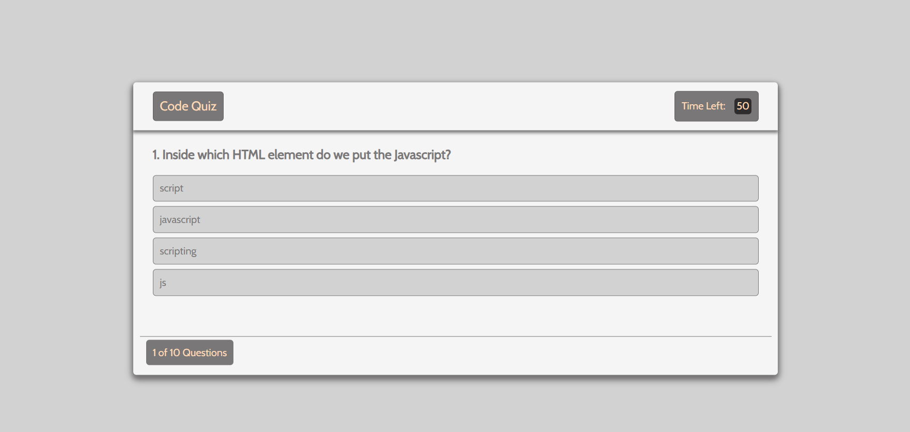

# Javascript Code Quiz

This repository contains a Javascript quiz game.  The game is stylzed completely in HTML, CSS, and Javascript.  In it, you will find:
* A "Rules" display that will inform you on the rules
* The main quiz complete with informative and interactive elements
* And a highscores section where you can jot down your initials

### Preview

Here is a small preview of the quiz...

### Appreciation

I would like to thank you for visiting my repository.  If there are any questions or comments, please feel free to reach out to me.  Feel free to also visit my website: [Code Quiz](https://davidesotomayor.github.io/code-quiz/)

#### Source:

These are a few of the sources that helped me out greatly:
* [James_Quick]https://www.youtube.com/channel/UC-T8W79DN6PBnzomelvqJYw
* [CodingNepal]https://www.youtube.com/c/CodingNepal
* [W3Schools]https://www.w3schools.com/
* [CodeExplained]https://www.youtube.com/c/CodeExplained

### License:

**Copyright (c) David Sotomayor**

Licensed under the [MIT](https://github.com/microsoft/vscode/blob/master/LICENSE.txt) license.